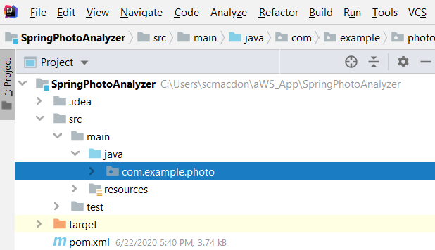
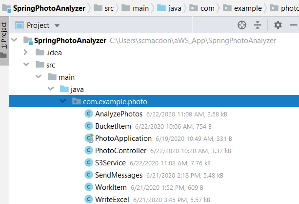

#  Create a Sample AWS Photo Analyzer application using the AWS SDK for Java

You can create an AWS application that analyzes nature images located in a S3 bucket. You can use the Amazon Rekognition service to analyze images. 
The application can analyze many images and generate a report that breaks down each image into a series of labels. 
For example, the following image shows a lake.

After the application analyzes this image, it creates this data. 
*	Panoramic - 99.99971
*	Outdoors - 99.99971
*	Nature - 99.99971
*	Landscape - 99.99971
*	Scenery	 - 99.99971
*	Wilderness - 96.90007
*	Water - 93.501465
*	Lake - 87.28128

In addition, this application uses the Simple Email Service (SES) to send a report to a given email recipient. In this tutorial, you create a Spring Boot application named AWS Photo Analyzer application. The Spring Boot APIs are used to build a model, different views, and a controller. For more information, see [Spring Boot - Securing Web Applications](https://www.tutorialspoint.com/spring_boot/spring_boot_securing_web_applications.htm).

This application uses these AWS Services: 
*	Amazon Rekognition
*	Amazon S3
*	Amazon Simple Email Service
*	AWS Elastic BeanStalk

**Cost to complete:** The AWS Services included in this document are included in the [AWS Free Tier](https://aws.amazon.com/free/?all-free-tier.sort-by=item.additionalFields.SortRank&all-free-tier.sort-order=asc). 

**Note:** Be sure to terminate all of the resources you create while going through this tutorial to ensure that you’re no longer charged.

#### Topics

+ Prerequisites
+ Understand the AWS Photo Analyzer application.
+ Create an IntelliJ project named SpringPhotoAnalyzer.
+ Add the POM dependencies to your project.
+	Create the Java classes. 
+	Package the project into a Jar file.
+	Deploy the application to the AWS Elastic Beanstalk.

## Prerequisites

To follow along with the tutorial, you need the following:

+ An AWS Account.
+ A Java IDE (for this tutorial, the IntelliJ IDE is used).
+ Java 1.8 JDK. 
+ Maven 3.6 or higher.
+ A S3 bucket named **photos**. For information, see [creating a S3 bucket](https://docs.aws.amazon.com/AmazonS3/latest/gsg/CreatingABucket.html).

## Understand the AWS Photo Analyzer application

The AWS Photo Analyzer application supports uploading images to a S3 bucket. After the images are uploaded, you can view the images that are analyzed.

To generate a report, you enter an email address and choose Analyze Photos. 

## Create an IntelliJ project named SpringPhotoAnalyzer

1. In the IntelliJ IDE, choose **File**, **New**, **Project**. 
2. In the **New Project** dialog box, choose **Maven**, and then choose **Next**. 
3. For **GroupId**, enter **aws-spring**. 
4. For **ArtifactId**, enter **SpringPhotoAnalyzer**. 
6. Choose **Next**.
7. Choose **Finish**. 

## Add the POM dependencies to your project

At this point, you have a new project named **SpringPhotoAnalyzer**.

Add the following dependencies for the Amazon services (AWS Java SDK version 2).

    <dependency>
      <groupId>software.amazon.awssdk</groupId>
      <artifactId>ses</artifactId>
    </dependency>
    <dependency>
      <groupId>software.amazon.awssdk</groupId>
      <artifactId>rekognition</artifactId>
   </dependency>
   <dependency>
    <groupId>software.amazon.awssdk</groupId>
    <artifactId>s3</artifactId>
   </dependency>
   
   **Note:**  Ensure that you are using Java 1.8 (as shown below).
   
   Add the Spring Boot dependencies. The pom.xml file looks like the following.
   
     <?xml version="1.0" encoding="UTF-8"?>
     <project xmlns="http://maven.apache.org/POM/4.0.0" xmlns:xsi="http://www.w3.org/2001/XMLSchema-instance"
         xsi:schemaLocation="http://maven.apache.org/POM/4.0.0 https://maven.apache.org/xsd/maven-4.0.0.xsd">
     <modelVersion>4.0.0</modelVersion>
     <groupId>com.example.photo</groupId>
     <artifactId>photo</artifactId>
     <version>0.0.1-SNAPSHOT</version>
     <name>photo</name>
     <description>Demo project for Spring Boot</description>
     <parent>
        <groupId>org.springframework.boot</groupId>
        <artifactId>spring-boot-starter-parent</artifactId>
        <version>2.0.4.RELEASE</version>
        <relativePath/> <!-- lookup parent from repository -->
     </parent>
     <properties>
        <java.version>1.8</java.version>
     </properties>
     <dependencyManagement>
        <dependencies>
            <dependency>
                <groupId>software.amazon.awssdk</groupId>
                <artifactId>bom</artifactId>
                <version>2.10.54</version>
                <type>pom</type>
                <scope>import</scope>
            </dependency>
        </dependencies>
     </dependencyManagement>
     <dependencies>
        <dependency>
            <groupId>org.springframework.boot</groupId>
            <artifactId>spring-boot-starter-thymeleaf</artifactId>
        </dependency>
        <dependency>
            <groupId>org.springframework.boot</groupId>
            <artifactId>spring-boot-starter-web</artifactId>
        </dependency>
        <dependency>
            <groupId>net.sourceforge.jexcelapi</groupId>
            <artifactId>jxl</artifactId>
            <version>2.6.10</version>
        </dependency>
        <dependency>
            <groupId>commons-io</groupId>
            <artifactId>commons-io</artifactId>
            <version>2.6</version>
        </dependency>
        <dependency>
            <groupId>javax.mail</groupId>
            <artifactId>javax.mail-api</artifactId>
            <version>1.6.2</version>
        </dependency>
        <dependency>
            <groupId>javax.mail</groupId>
            <artifactId>javax.mail-api</artifactId>
            <version>1.5.5</version>
        </dependency>
        <dependency>
            <groupId>com.sun.mail</groupId>
            <artifactId>javax.mail</artifactId>
            <version>1.5.5</version>
        </dependency>
        <dependency>
            <groupId>org.springframework.boot</groupId>
            <artifactId>spring-boot-starter-test</artifactId>
            <scope>test</scope>
            <exclusions>
                <exclusion>
                    <groupId>org.junit.vintage</groupId>
                    <artifactId>junit-vintage-engine</artifactId>
                </exclusion>
            </exclusions>
        </dependency>
         <dependency>
            <groupId>software.amazon.awssdk</groupId>
            <artifactId>dynamodb</artifactId>
        </dependency>
        <dependency>
            <groupId>software.amazon.awssdk</groupId>
            <artifactId>ses</artifactId>
        </dependency>
        <dependency>
            <groupId>software.amazon.awssdk</groupId>
            <artifactId>rekognition</artifactId>
        </dependency>
        <dependency>
            <groupId>software.amazon.awssdk</groupId>
            <artifactId>s3</artifactId>
        </dependency>
      </dependencies>
      <build>
        <plugins>
            <plugin>
                <groupId>org.springframework.boot</groupId>
                <artifactId>spring-boot-maven-plugin</artifactId>
            </plugin>
        </plugins>
      </build>
     </project>

## Create the Java classes 

Create a Java package in the main/java folder named **com.example.photo**.

The Java files go into this package.

Create these Java classes: 

+ **AnalyzePhotos** - Uses the Amazon Rekognition API to analyze the images. 
+ **BucketItem** - Used as a model that stores S3 bucket information.   
+ **PhotoApplication** - Used as the base class for the Spring Boot application.
+ **PhotoController** - Used as the Spring Boot Controller that handles HTTP requests. 
+ **S3Service** - Uses the Amazon S3 API to perform S3 operations. 
+ **WorkItem** - Used as a model that stores Rekognition data.
+ **WriteExcel** – Uses the JXL API (this is not an AWS API) to dynamically generate a report.     
