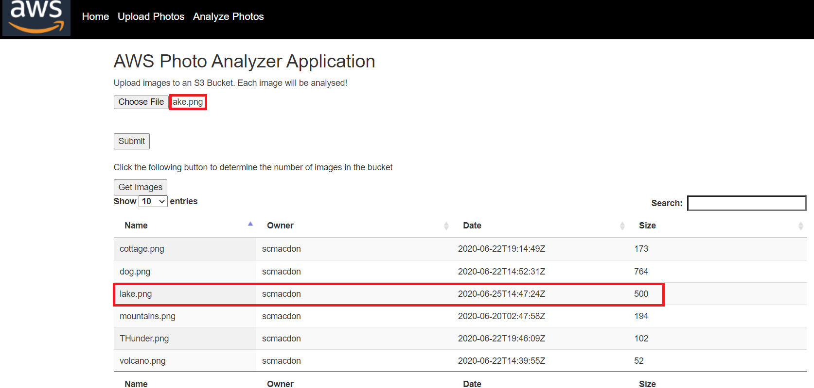
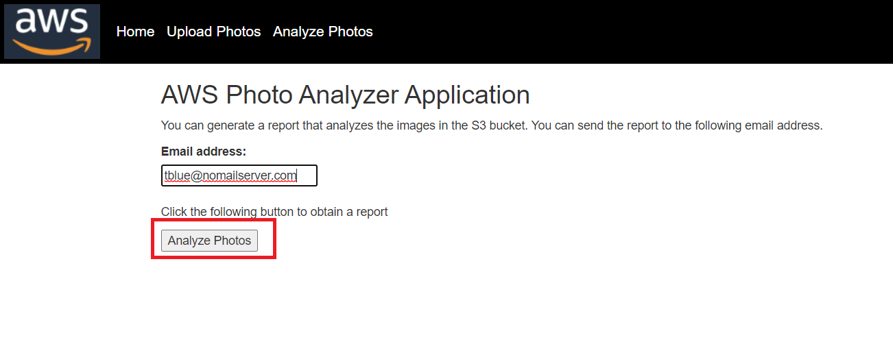
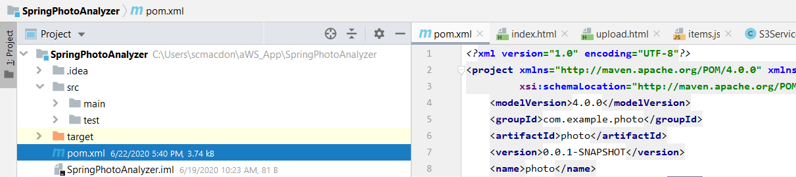

#  Create a Sample AWS Photo Analyzer application using the AWS SDK for Java

You can create an AWS application that analyzes nature images located in a S3 bucket. You can use the Amazon Rekognition service to analyze images. 
The application can analyze many images and generate a report that breaks down each image into a series of labels. 
For example, the following image shows a lake.

After the application analyzes this image, it creates this data. 
*	Panoramic - 99.99971
*	Outdoors - 99.99971
*	Nature - 99.99971
*	Landscape - 99.99971
*	Scenery	 - 99.99971
*	Wilderness - 96.90007
*	Water - 93.501465
*	Lake - 87.28128

In addition, this application uses the Simple Email Service (SES) to send a report to a given email recipient. In this tutorial, you create a Spring Boot application named AWS Photo Analyzer application. The Spring Boot APIs are used to build a model, different views, and a controller. For more information, see [Spring Boot - Securing Web Applications](https://www.tutorialspoint.com/spring_boot/spring_boot_securing_web_applications.htm).

This application uses these AWS Services: 
*	Amazon Rekognition
*	Amazon S3
*	Amazon Simple Email Service
*	AWS Elastic BeanStalk

**Cost to complete:** The AWS Services included in this document are included in the [AWS Free Tier](https://aws.amazon.com/free/?all-free-tier.sort-by=item.additionalFields.SortRank&all-free-tier.sort-order=asc). 

**Note:** Be sure to terminate all of the resources you create while going through this tutorial to ensure that you’re no longer charged.

#### Topics

+ Prerequisites
+ Understand the AWS Photo Analyzer application.
+ Create an IntelliJ project named SpringPhotoAnalyzer.
+ Add the POM dependencies to your project.
+	Create the Java classes. 
+	Package the project into a Jar file.
+	Deploy the application to the AWS Elastic Beanstalk.

## Prerequisites

To follow along with the tutorial, you need the following:

+ An AWS Account.
+ A Java IDE (for this tutorial, the IntelliJ IDE is used).
+ Java 1.8 JDK. 
+ Maven 3.6 or higher.
+ A S3 bucket named **photos**. For information, see [creating a S3 bucket](https://docs.aws.amazon.com/AmazonS3/latest/gsg/CreatingABucket.html).

## Understand the AWS Photo Analyzer application

The AWS Photo Analyzer application supports uploading images to a S3 bucket. After the images are uploaded, you can view the images that are analyzed.

To generate a report, you enter an email address and choose Analyze Photos. 

## Create an IntelliJ project named SpringPhotoAnalyzer

1. In the IntelliJ IDE, choose **File**, **New**, **Project**. 
2. In the **New Project** dialog box, choose **Maven**, and then choose **Next**. 
3. For **GroupId**, enter **aws-spring**. 
4. For **ArtifactId**, enter **SpringPhotoAnalyzer**. 
6. Choose **Next**.
7. Choose **Finish**. 

## Add the POM dependencies to your project

At this point, you have a new project named **SpringPhotoAnalyzer**.

